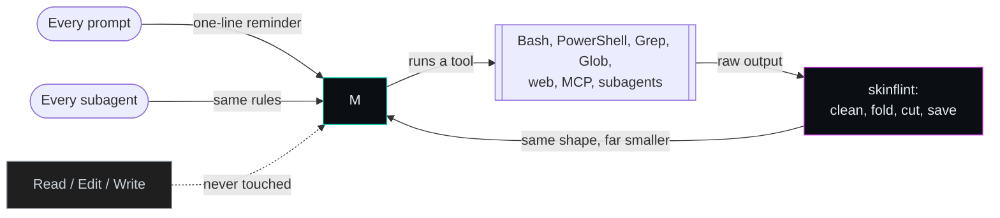

<p align="center">
  
</p>

<p align="center">
  <b>Make Claude Code say more with fewer tokens.</b><br>
  Shorter answers, leaner code, trimmed tool output. Zero dependencies.
</p>

<p align="center">
  
  
  
  
</p>

---

Every token Claude writes, and every line of tool output it reads, is paid for
again on each later turn. skinflint cuts the ones that carry nothing and
keeps every one that carries a fact.

<p align="center"><b>59% fewer output tokens and 38% lower cost on everyday questions &middot; 29% fewer output tokens and 28% lower cost on tool-using tasks &middot; the lowest of four plugins tested on both &middot; zero dependencies</b></p>

- **Tighter answers.** The answer first, the likely cause and its fix, no
  filler, no recap, no wall of headings and bullets.
- **Leaner code.** The smallest change that works: reuse, then the standard
  library, then the platform, before any new code or dependency.
- **Trimmed tool output.** Long command output is cleaned and cut before
  Claude reads it. Error lines from the cut part are kept, and the full text
  is saved to a file Claude can search instead of re-running the command.
- **Nothing to install.** Pure POSIX `sh` + `awk` on Linux, macOS and WSL; on
  Windows a small program built on first use with the compiler that ships
  with Windows. No Node, no Python, no package manager.
- **Faster than every other plugin measured.** On every hook, on Linux and on
  Windows from Git Bash, PowerShell 5.1 and PowerShell 7, skinflint's hooks
  finish first (see [Faster hooks](#faster-hooks)).
- **Tested to the byte.** One written [specification](SPEC.md), two
  implementations, 188 test cases that must produce identical bytes on both.

Same model, same question, one difference: skinflint. Both answers are
verbatim from the [benchmark run](https://github.com/SkYn3t-Lab/skinflint-tests/tree/main/benchmarks/results/2026-10-05/questions/runs),
the first repetition of each:

> What is the difference between git merge and git rebase?

<table>
<tr><th align="left" width="50%">No plugin: 552 output tokens</th>
<th align="left" width="50%">skinflint: 264 output tokens</th></tr>
<tr valign="top"><td>

Both integrate changes from one branch into another; they differ in what they do to history.

**Merge** ties the two branches together with a new merge commit that has both as parents. Existing commits are untouched.

```
A---B---C---M   main
     \     /
      D---E     feature
```

**Rebase** replays your commits one by one on top of the target branch, creating new commits with new hashes. The result is a straight line, as if you had started your work from the latest tip.

```
A---B---C---D'---E'   feature (rebased onto main)
```

*... 16 more lines*

</td><td>

Both integrate changes from one branch into another, but merge preserves history as it happened while rebase rewrites it to be linear.

`git merge feature` ties the two branches together with a new merge commit that has both as parents; existing commits are untouched, so it is safe on shared branches, at the cost of a branching, sometimes noisy history.

`git rebase main` replays your branch's commits one by one on top of `main`, creating new commits with new hashes; the result is a straight line with no merge commit, but anyone else who has the old commits will now have a diverged branch.

The practical rule: rebase local, unpushed work to tidy it up before sharing, and merge once a branch is public. If you do rebase a pushed branch, you must force-push (`git push --force-with-lease`), which is only safe when nobody else is working on it.

</td></tr>
</table>

## What it trims

| | The waste | What skinflint does |
|---|---|---|
| **Prose** | Preambles, recaps, hedging, headings and bullet walls nobody asked for | A one-line reminder with every prompt |
| **Code** | Abstractions with one user, boilerplate "for later", new dependencies for a few lines | A decision ladder: reuse, standard library, platform, installed dependency, then the least new code |
| **Tool output** | Build logs, test runs, stack traces and listings read into context and billed again every turn | Cleaned and cut before Claude reads it; errors kept; the full text saved to a file |



Tool output is the part that compounds: every line read into the
conversation is sent again with each later request, so cutting it once pays
off on every turn after.

---

## Everything it does

### Answers and code

- **A one-line reminder with every prompt**, so the rules steer every answer
  and are never summarised away. Nothing longer is added: in testing, a full
  ruleset at session start cost more as input than it saved, and the reminder
  alone cut output as far. The full rules are in the `skinflint` skill.
- **Code first, three lines after.** Code comes before any words about it,
  followed by at most three short lines on what was left out and when to add
  it. No second version, no usage demo, no test file nobody asked for, and
  code you asked to see arrives in the reply rather than in a new file.
- **No narration between tool calls.** No "now I will..." before each command
  and no summary of a result it is about to act on.
- **Shortcuts you can find again.** A corner deliberately cut in the code gets
  a `skinflint:` comment naming its limit, and `/skinflint-debt` lists
  them all later.
- **Subagents follow the same rules.** Every subagent Claude starts is told to
  report back the same way.
- **On and off per session, or per project.** The mode belongs to the session
  and survives compaction; another session keeps its own. A project can turn
  it off, or drop the prose or code rules, with `.claude/skinflint.json`.
- **Switches that don't misfire.** Only a whole message such as
  `stop skinflint` switches it; "add a normal mode toggle" does not.
- **Plays well with output styles.** If you use a custom output style, the prose
  rules step aside for it. Prose and code rules can each be switched off.

### Tool output

Applied to Bash, PowerShell, Grep, Glob, WebFetch, WebSearch, subagent results
and every MCP tool:

| Noise | Becomes |
|---|---|
| Colour codes, trailing spaces, blank-line runs | removed |
| Progress bars redrawn with `\r` | only the final state |
| The same line repeated | one line + "repeated N more times" |
| Log lines that differ only in their timestamp | first, a count, last |
| 40-frame stack traces (JavaScript, Java, C#, Python, gdb) | first 3 and last 2 frames |
| Hundreds of passing tests (Jest, Go, pytest, TAP, "PASS") | first, a count, last; failures always kept |
| A 500 KB line of minified JSON | its head and tail |
| Windows UTF-16 output (a NUL after every letter) | plain text |
| Still over 8 KB | first 60 and last 40 lines, plus the first 12 error lines from the middle with one line of context each |
| The exact same output as last time | a one-line note and its first lines |

- **Nothing is lost.** Whenever lines are cut, the full text is saved to a file
  and the note tells Claude where, so it searches the file instead of running
  the command again.
- **Knows an error from a success.** "0 errors", "no failures" and
  "errors: 0" are not treated as errors; "terror" and "errorless" are not
  either.
- **Secrets stay off disk.** Output that looks like it holds a private key, an
  API key, a token or a password is never saved to a file.
- **Leaves alone what must stay exact.** Read, Edit and Write are never
  touched. `cat`, `head`, `git diff`, `Get-Content` and similar commands are
  kept whole up to 12 KB, because Claude asked to see that text; beyond that
  only their head and tail are kept, with the full text saved. Claude Code
  edits a file only after reading it with Read, so this never changes what an
  edit is based on. Failed commands and output Claude Code already saved to
  disk pass through unchanged.
- **Keeps the tool's own shape.** Only the text fields change; every other
  field of the result is passed on byte for byte. Cuts never split a UTF-8
  character.
- **Cleans up after itself.** The newest 40 saved outputs are kept, and session
  state older than a week is removed.

### Everywhere, with nothing to install

- **Linux, macOS, WSL:** POSIX `sh` + `awk`. Tested with mawk, gawk, BWK awk
  (macOS) and busybox awk, under dash, bash and busybox `sh`.
- **Windows:** a small program compiled on first use by the C# compiler that
  ships with Windows. Works from Git Bash, Windows PowerShell 5.1 and
  PowerShell 7, and PowerShell's script execution policy does not matter.
- **No network access**, ever. No telemetry, no update check.
- **Private state.** Everything it writes lives in `~/.claude/skinflint/`,
  readable only by you.

### Extras

- `/skinflint-stats` shows everything saved so far: tool output trimmed, the
  estimated saving on replies, and what the plugin itself adds, with the net.
- `/skinflint-debt` lists every shortcut marked with a `skinflint:`
  comment, with when it would be worth doing properly.
- `/skinflint-review` reviews your diff for code that can be deleted.
- `/skinflint-audit` ranks everything removable in a file, diff or repo, code
  and prose, biggest first.
- A status line showing the mode and roughly how many tokens have been saved,
  net of what the plugin adds.

### Seeing what it saves

The hooks keep five counters in one small file, and `/skinflint-stats` turns
them into four figures:

| Figure | Where it comes from |
|---|---|
| Tool output trimmed | Measured: the bytes removed from tool results, and how many results were shortened |
| Replies | Estimated: the bytes of the replies Claude actually wrote, times 33/67 |
| Cost of the plugin | Measured: the bytes of rules and reminders skinflint itself added to your conversations |
| Net | The first two minus the third |

Only the reply figure is an estimate. The benchmark below ran the same
tool-using tasks with and without the plugin, and with it Claude's final
replies were 67% of the size; in
your own sessions each prompt is answered once, with the plugin on, so there
is no second reply to compare, and that measured ratio is applied to what was
written. The plugin counts the length of each final reply and keeps none of
its text.

The net can be small or negative in a short session, because the reminder is
added once per prompt whatever the replies
come to. Bytes also understate the money side: trimmed tool output and the
plugin's own text are input, while replies are output, which costs several
times more per token.

## How it compares

Measured in the benchmarks below, or read from each plugin's own code:

| | skinflint | [chisle](https://github.com/JayPokale/Chisle) | [ponytail](https://github.com/dietrichgebert/ponytail) | [caveman](https://github.com/JuliusBrussee/caveman) |
|---|---|---|---|---|
| Questions: output tokens (% of no plugin) | **41%** | 73% | 87% | 72% |
| Questions: cost (% of no plugin) | **62%** | 84% | 98% | 93% |
| Questions: worst single one (% of no plugin) | **86%** | 209% | 233% | 109% |
| Questions: answers graded correct (no plugin 58/60) | 58/60 | 53/60 | 58/60 | 54/60 |
| Tool-using tasks: output tokens (% of no plugin) | **71%** | 87% | 95% | 94% |
| Tool-using tasks: cost (% of no plugin) | **72%** | 82% | 98% | 90% |
| Tool-using tasks: checks passed | 24/24 | 24/24 | 24/24 | 24/24 |
| Trims tool output | **yes, 4.2%** | yes, 4.0% | no | no |
| Needs a runtime | **no** | Node.js | Node.js | Node.js |
| Prompt hook, Linux / Windows Git Bash | **7 ms / 95 ms** | 40 ms / 120 ms | 39 ms / 105 ms | 44 ms / 163 ms |
| Works on Windows without Git Bash | **yes** | yes | yes | no, its hooks fail under PowerShell |
| Trims PowerShell tool output (Windows' default shell tool) | **yes** | no | no tool-output trimming | no tool-output trimming |
| Steers subagents | **yes** | no | yes | no |
| Keeps secrets out of saved output | **yes** | no | saves no output | saves no output |
| Network calls | **none** | an update check | none | none |

## Install

You need Claude Code and nothing else. Install once per computer.

**1. Open a terminal** (Terminal on macOS and Linux, PowerShell or Git Bash on
Windows). Run these two commands there, not inside a Claude Code session:

```sh
claude plugin marketplace add SkYn3t-Lab/skinflint
claude plugin install skinflint@skinflint
```

- The first command tells Claude Code where to find the plugin: this GitHub
  repository. Claude Code calls such a source a *marketplace*. It prints
  `Successfully added marketplace: skinflint`.
- The second installs the plugin for your user, in every project. The name
  reads *plugin*@*marketplace*; here both are called `skinflint`.

**2. Start a new Claude Code session.** A session that was already open picks
the plugin up after you type `/reload-plugins` in it.

**3. Check it works.** In the session, type `/skinflint-help`: it lists the
commands below. From a terminal, `claude plugin list` includes
`skinflint@skinflint`. On Windows the very first hook builds a small helper
program, which takes under a second and happens once.

If you use another plugin that does the same job, uninstall it first, or
everything is trimmed twice.

**Prefer to stay inside Claude Code?** Type the same two steps as slash
commands. The second opens a panel: choose *Install for you*.

```text
/plugin marketplace add SkYn3t-Lab/skinflint
/plugin install skinflint@skinflint
```

**If adding the marketplace fails**, git on your computer cannot reach the
repository. Claude Code clones it with your normal git setup, so sign in to
GitHub the way you usually do (for example `gh auth login`) and run the
command again.

### Update

```sh
claude plugin marketplace update skinflint
claude plugin update skinflint@skinflint
```

The first fetches the latest version from GitHub, the second installs it.
Start a new session (or `/reload-plugins`) to use it.

### Remove

```sh
claude plugin uninstall skinflint@skinflint
claude plugin marketplace remove skinflint
```

The first removes the plugin; the second removes the marketplace entry as
well. Either one alone switches skinflint off.

## Use

| Say or type | What happens |
|---|---|
| `/skinflint`, `skinflint on` | Turn it on for this session |
| `stop skinflint`, `normal mode`, `/skinflint off` | Turn it off for this session |
| `/skinflint-stats` | Everything saved so far: tool output, replies (estimated) and the plugin's own cost |
| `/skinflint-debt` | List every shortcut marked with a `skinflint:` comment |
| `/skinflint-review` | Review the current diff for code that can be removed |
| `/skinflint-audit [path]` | Rank everything removable, code and prose, biggest first |
| `/skinflint-help` | Show this list |

A switch works only as the whole message: "add a normal mode toggle" does not
turn anything off. The mode belongs to the session and survives compaction.

## Settings

Environment variables, in `settings.json` under `env` or in your shell:

| Variable | Effect |
|---|---|
| `SKINFLINT_DEFAULT_MODE=off` | Sessions start off; turn it on per session |
| `SKINFLINT_COMPRESS=0` | Leave tool output alone |
| `SKINFLINT_DEDUP=0` | Do not replace repeated output |
| `SKINFLINT_SPILL=0` | Do not save full text to disk |
| `SKINFLINT_TOOLS=Bash,Grep` | Only these tools |
| `SKINFLINT_MAX_BYTES` | Size before lines are cut (default 8000) |
| `SKINFLINT_HEAD_LINES`, `SKINFLINT_TAIL_LINES` | Lines kept at each end (60, 40) |

A config file does the same for the mode and for which parts of the rules load:
`~/.config/skinflint/config.json` (`%APPDATA%\skinflint\config.json` on
Windows):

```json
{ "defaultMode": "on", "sections": { "prose": true, "code": true } }
```

A project can override any of these keys in `.claude/skinflint.json` at its
root, for example `{ "defaultMode": "off" }` to keep skinflint out of one
repository. The environment variable still wins over both files, and a switch
typed in a session wins over everything for that session.

If you use a custom output style, the prose rules step aside for it.

**Status line** (optional): `sh "<plugin>/hooks/statusline.sh"`, or on Windows
`powershell -NoProfile -ExecutionPolicy Bypass -File "<plugin>\hooks\win\statusline.ps1"`.
It shows the mode and roughly how many tokens have been saved, net of what the
plugin adds; the saving on replies in that figure is an estimate.

State lives in `~/.claude/skinflint/`: per-session mode, the last output of
each tool for the duplicate check, saved full texts (the newest 40 are kept)
and a running total.

## Numbers

Everything in this section except the hook timings and the tool-output replay
was measured in one run on 2026-10-05: skinflint 0.4.0,
[chisle](https://github.com/JayPokale/Chisle) at commit `c200401`, [ponytail](https://github.com/dietrichgebert/ponytail) at `c982cd4` and [caveman](https://github.com/JuliusBrussee/caveman) at
`6571943`, each loaded as a real plugin through `claude -p` on Claude Opus
5.5, three times per task. Every run happens in a throwaway configuration that
holds nothing but the login, inside a sandbox in which the home directory is
empty, so the plugin is the only difference between two runs of a task. None
of the 465 runs ended in an error, and the transcripts of the 165 tool-using
runs confirm that each plugin's hooks loaded in every one of its runs.

Three repetitions leave noise: the same skinflint version measured 85% of
no-plugin cost on the tool-using tasks one day and 72% the next. Read a single
figure as good to about ten points. The order of the four plugins was the same
in every run.

### Everyday questions

Twenty developer requests, five each of short and long coding tasks and short
and long explanations. A separate judge, which sees only the question and the
answer and never which plugin wrote it, graded every answer for correctness.

<p align="center"><picture>
  <source media="(prefers-color-scheme: dark)" srcset="https://raw.githubusercontent.com/SkYn3t-Lab/skinflint-tests/main/assets/charts/output-overall-dark.png">
  
</picture></p>

| Plugin | Output tokens, all questions | Cost | Average question | Worst question | Questions longer than no plugin | Answers graded correct |
|---|--:|--:|--:|--:|--:|--:|
| **skinflint** | **41%** | **62%** | **46%** | **86% (offbyone)** | **0** | 58/60 |
| [chisle](https://github.com/JayPokale/Chisle) | 73% | 84% | 95% | 209% (envvar) | 4 | 53/60 |
| [ponytail](https://github.com/dietrichgebert/ponytail) | 87% | 98% | 94% | 233% (retry) | 6 | 58/60 |
| [caveman](https://github.com/JuliusBrussee/caveman) | 72% | 93% | 68% | 109% (migration) | 1 | 54/60 |
| no plugin | 100% | 100% | 100% | 100% | 0 | 58/60 |

Output tokens and cost are a share of what the same model wrote and cost with
no plugin, so lower is better. Cost is what Claude Code reported for each run
at list price, so it includes the text each plugin adds to the conversation.
skinflint is shortest overall and in every kind of question, has the best
worst case, and no question came out longer than without it. Its answers were
graded correct as often as answers written with no plugin.

<p align="center"><picture>
  <source media="(prefers-color-scheme: dark)" srcset="https://raw.githubusercontent.com/SkYn3t-Lab/skinflint-tests/main/assets/charts/output-by-kind-dark.png">
  
</picture></p>

| Kind of question | skinflint | [chisle](https://github.com/JayPokale/Chisle) | [ponytail](https://github.com/dietrichgebert/ponytail) | [caveman](https://github.com/JuliusBrussee/caveman) |
|---|--:|--:|--:|--:|
| Coding, short | **41%** | 111% | 127% | 77% |
| Coding, long | **36%** | 67% | 78% | 68% |
| Explaining, short | **41%** | 80% | 82% | 53% |
| Explaining, long | **51%** | 77% | 97% | 81% |

<details>
<summary>Every question (skinflint shortest on 19 of 20)</summary>

| Question | Kind | No plugin, tokens | skinflint | chisle | ponytail | caveman |
|---|---|--:|--:|--:|--:|--:|
| `debounce` | coding, short | 1389 | **38** | 83 | 74 | 82 |
| `dedupe` | coding, short | 263 | **37** | 86 | 50 | 43 |
| `envvar` | coding, short | 221 | **51** | 209 | 153 | 52 |
| `offbyone` | coding, short | 65 | **86** | 160 | 98 | 97 |
| `retry` | coding, short | 840 | **41** | 136 | 233 | 84 |
| `cache` | coding, long | 7693 | **17** | 32 | 30 | 34 |
| `migration` | coding, long | 1717 | **75** | 98 | 109 | 109 |
| `statemachine` | coding, long | 3710 | **18** | 60 | 55 | 77 |
| `csvreport` | coding, long | 6104 | **70** | 89 | 97 | 89 |
| `ratelimit` | coding, long | 8527 | **29** | 79 | 111 | 73 |
| `backref` | explain, short | 189 | 49 | 160 | 70 | **39** |
| `pooling` | explain, short | 947 | **33** | 66 | 89 | 55 |
| `gitrebase` | explain, short | 563 | **49** | 71 | 86 | 55 |
| `unrelated` | explain, short | 715 | **37** | 84 | 70 | 56 |
| `deadlock` | explain, short | 872 | **47** | 79 | 83 | 52 |
| `restgraphql` | explain, long | 987 | **27** | 77 | 79 | 61 |
| `postmortem` | explain, long | 5733 | **51** | 54 | 104 | 93 |
| `monolith` | explain, long | 1791 | **54** | 99 | 101 | 78 |
| `apidesign` | explain, long | 4250 | **57** | 96 | 94 | 83 |
| `rerender` | explain, long | 1776 | **46** | 80 | 83 | 54 |

Figures are % of no plugin, the lowest in bold. Every prompt is in
[`benchmarks/tasks.tsv`](https://github.com/SkYn3t-Lab/skinflint-tests/blob/main/benchmarks/tasks.tsv) and every answer with its grade
in [`benchmarks/results/2026-10-05/questions/`](https://github.com/SkYn3t-Lab/skinflint-tests/tree/main/benchmarks/results/2026-10-05/questions).

</details>

### Tool-using tasks

Questions show what a plugin does to an answer. Most Claude Code work is not
that: Claude reads files, runs commands and edits code over several turns, and
there a plugin's own text is paid for again on every one of them. So the same
plugins were run on eight tasks in a small generated project, each with one
planted problem (a failing test, an outage in a log, a script to extend, a
convention to enforce) and a check that runs or reads what Claude left behind
and passes or fails it.

| Plugin | Cost | Output tokens | Input tokens | Turns | Final reply size | Checks passed |
|---|--:|--:|--:|--:|--:|--:|
| **skinflint** | **72%** | **71%** | **85%** | **80%** | **67%** | 24/24 |
| [chisle](https://github.com/JayPokale/Chisle) | 82% | 87% | 107% | 88% | 76% | 24/24 |
| [ponytail](https://github.com/dietrichgebert/ponytail) | 98% | 95% | 117% | 88% | 96% | 24/24 |
| [caveman](https://github.com/JuliusBrussee/caveman) | 90% | 94% | 117% | 100% | 71% | 24/24 |
| no plugin | 100% | 100% | 100% | 100% | 100% | 24/24 |

Every plugin got every task right, so the difference is what it cost to get
there. skinflint is the only one of the four that lowers input tokens: the
others add several thousand bytes of rules to every session, which is sent
again with each request, while skinflint adds one short reminder per prompt.

<details>
<summary>Every task, cost as % of no plugin</summary>

| Task | What Claude was asked | No plugin, cost | skinflint | chisle | ponytail | caveman |
|---|---|--:|--:|--:|--:|--:|
| `bugfix` | The tests are failing. Find out why and fix it. | $0.09 | **97** | 113 | 122 | 115 |
| `logs` | The api went down last night. Look at logs/service.log and tell me what happened. | $0.24 | **49** | 51 | 89 | 64 |
| `dryrun` | Add a --dry-run option to scripts/backup.sh that shows what it would copy without copying anything, and update the README to match. | $0.14 | **70** | 79 | 88 | 98 |
| `compose` | Does docker-compose.yml follow our conventions? Fix whatever does not. | $0.11 | **81** | 92 | 104 | 91 |
| `mail` | Which scripts send mail without going through the shared helper? Fix them. | $0.11 | **86** | 104 | 104 | 107 |
| `bump` | Bump the version to 1.4.0 everywhere. The change is a new --json flag on the low-stock report. | $0.11 | **79** | 93 | 104 | 93 |
| `disk` | What is using the space under data/ ? | $0.07 | **83** | **83** | 90 | 94 |
| `review` | Review app/inventory.py and tell me what is wrong with it. Do not change any file. | $0.09 | **64** | 82 | 95 | 99 |

The lowest is in bold. The project generator, the prompts and the checks are in
[`benchmarks/agentic/`](https://github.com/SkYn3t-Lab/skinflint-tests/blob/main/benchmarks/agentic), and every run with its verdict in
[`benchmarks/results/2026-10-05/agentic/`](https://github.com/SkYn3t-Lab/skinflint-tests/tree/main/benchmarks/results/2026-10-05/agentic).

</details>

### Less tool output

Output-token rules only shape what Claude writes; tool output is what it reads,
and every line of it is sent again with each later request. To measure that
part (on 2026-09-30; the trimming code has not changed since), 7,677 real tool results from 627 of the author's own Claude Code sessions
were replayed through each plugin's PostToolUse hook, in session order, exactly
as Claude Code would have sent them:

| Plugin | Tool output removed | Results shortened |
|---|--:|--:|
| **skinflint** | **4.2%** | **97** |
| [chisle](https://github.com/JayPokale/Chisle) | 4.0% | 84 |
| [ponytail](https://github.com/dietrichgebert/ponytail) | 0% (no tool-output hook) | 0 |
| [caveman](https://github.com/JuliusBrussee/caveman) | 0% (no tool-output hook) | 0 |

Most tool results are short and pass through untouched; the saving comes from
the 97 long ones skinflint shortened. Results Claude Code had already saved
to a file (21 of them) are left out for both, since Claude only ever saw a
short preview of those.

### What it saves in dollars

The cost columns above are the answer, measured and not extrapolated: Claude
Code reports what each run cost at list price, and with skinflint the same
work cost 72% of the no-plugin price on tool-using tasks and 62% on
questions. On $100 of Claude Code use that is roughly $28 to $38
kept, depending on how much of the work is tools and how much is answers.
Trimmed tool output adds to that in long sessions, where every line read is
sent again on each later turn; the benchmark tasks are too short to show it.

The benchmark scripts and their results live in their own repository,
[skinflint-tests](https://github.com/SkYn3t-Lab/skinflint-tests), so that installing the plugin does not download them.
Reproduce everything from a clone of it with
`ARMS="none:- skinflint:<dir> ..." bash benchmarks/run-arms-sandboxed.sh OUTDIR 3 claude-opus-5-5`,
`bash benchmarks/grade.sh OUTDIR GRADES.json`,
`python3 benchmarks/analyze-arms.py OUTDIR GRADES.json`,
`ARMS="none:- skinflint:<dir> ..." bash benchmarks/agentic/run-agentic.sh OUTDIR 3 claude-opus-5-5`,
`python3 benchmarks/agentic/analyze-agentic.py OUTDIR`
and, for tool output,
`python3 benchmarks/replay.py --arm skinflint='sh <dir>/hooks/run.sh compress' ~/.claude/projects --out R.json`.
The data behind every benchmark number here is in
[`benchmarks/results/2026-10-05/`](https://github.com/SkYn3t-Lab/skinflint-tests/tree/main/benchmarks/results/2026-10-05);
the replay and the hook timings are in
[`benchmarks/results/2026-09-30/`](https://github.com/SkYn3t-Lab/skinflint-tests/tree/main/benchmarks/results/2026-09-30).

### Faster hooks

Every hook Claude Code runs costs time on every prompt, tool call and session
start. Each plugin's own hook commands were timed the way Claude Code runs
them, as medians of 41 interleaved rounds so that load on the machine falls on
every plugin alike, with [`benchmarks/speed.py`](https://github.com/SkYn3t-Lab/skinflint-tests/blob/main/benchmarks/speed.py) on Linux
and [`benchmarks/speed.ps1`](https://github.com/SkYn3t-Lab/skinflint-tests/blob/main/benchmarks/speed.ps1) on Windows 11.

<p align="center"><picture>
  <source media="(prefers-color-scheme: dark)" srcset="https://raw.githubusercontent.com/SkYn3t-Lab/skinflint-tests/main/assets/charts/speed-dark.png">
  
</picture></p>

| Linux, ms | startup | prompt | subagent | 30 KB log | 150 KB log | 150 KB JSON |
|---|--:|--:|--:|--:|--:|--:|
| **skinflint** | **10** | **7** | **7** | **12** | **16** | **15** |
| [chisle](https://github.com/JayPokale/Chisle) | 136 | 40 | no hook | 69 | 75 | 66 |
| [ponytail](https://github.com/dietrichgebert/ponytail) | 36 | 39 | 42 | no hook | no hook | no hook |
| [caveman](https://github.com/JuliusBrussee/caveman) | 43 | 44 | no hook | no hook | no hook | no hook |

| Windows 11, ms | startup | prompt | subagent | small output | 3000 lines | 30 KB log |
|---|--:|--:|--:|--:|--:|--:|
| **skinflint**, Git Bash | **100** | **95** | **95** | **98** | **120** | **125** |
| [chisle](https://github.com/JayPokale/Chisle), Git Bash | 260 | 120 | no hook | 122 | 153 | 150 |
| [ponytail](https://github.com/dietrichgebert/ponytail), Git Bash | 109 | 105 | 104 | no hook | no hook | no hook |
| [caveman](https://github.com/JuliusBrussee/caveman), Git Bash | 167 | 163 | no hook | no hook | no hook | no hook |
| **skinflint**, PowerShell 5.1 | **166** | **164** | **162** | **167** | **194** | **194** |
| [chisle](https://github.com/JayPokale/Chisle), PowerShell 5.1 | 331 | 188 | no hook | 188 | 220 | 224 |
| [ponytail](https://github.com/dietrichgebert/ponytail), PowerShell 5.1 | 193 | 186 | 182 | no hook | no hook | no hook |
| [caveman](https://github.com/JuliusBrussee/caveman), PowerShell 5.1 | fails | fails | no hook | no hook | no hook | no hook |
| **skinflint**, PowerShell 7 | **317** | **301** | **316** | **322** | **363** | **366** |
| [chisle](https://github.com/JayPokale/Chisle), PowerShell 7 | 494 | 343 | no hook | 346 | 383 | 371 |
| [ponytail](https://github.com/dietrichgebert/ponytail), PowerShell 7 | 344 | 336 | 347 | no hook | no hook | no hook |
| [caveman](https://github.com/JuliusBrussee/caveman), PowerShell 7 | fails | fails | no hook | no hook | no hook | no hook |

The fastest time in each column and shell is in bold. "no hook" means the
plugin does not run anything at that point (ponytail and caveman do not trim
tool output at all). caveman's hook commands are written in shell syntax, so
they fail under PowerShell, which Claude Code uses on Windows when Git Bash is
not installed. ponytail's prompt hook prints nothing on an ordinary prompt: it
only reports mode changes. skinflint needs no runtime: on Linux a hook is one
`sh` and one `awk`; on Windows, Git Bash runs the compiled program directly,
and PowerShell loads it into the PowerShell that is already running, so no
second process starts.

## How one hook line runs everywhere

Claude Code runs a plugin's hook command with `sh` on Linux and macOS, with Git
Bash on Windows, and with PowerShell on Windows without Git Bash. Each hook is
one command that reads correctly in both languages: `sh` sees a no-op group
and then `exec`s the right program, so it never reads further; PowerShell
sees the `sh` lines inside a block comment and runs the lines after it.
`tools/stamp.sh` writes these lines into `.claude-plugin/plugin.json`, and embeds
the awk program (`hooks/lib/skinflint.awk`) in `hooks/run.sh`, so that the POSIX
hook is one file that runs no other.

## Tests

The tests live in [skinflint-tests](https://github.com/SkYn3t-Lab/skinflint-tests). Clone it beside this repository and
run:

```sh
sh skinflint-tests/tests/golden.sh                                            # POSIX
powershell -ExecutionPolicy Bypass -File skinflint-tests\tests\golden.ps1     # Windows
```

Both test the plugin in `../skinflint`; set `PLUGIN_ROOT` to test another copy.
`tests/cases/` holds one case per behaviour in SPEC.md, each with its input,
expected output and expected files on disk. `golden.sh` runs every case through
the real hook line; `golden.ps1` runs it through the Windows program. Both pass
on dash, bash and busybox `sh`, with mawk, gawk, BWK awk and busybox awk, and on
Windows PowerShell 5.1 and PowerShell 7. `tests/make_cases.py` regenerates the
cases (the only part that needs Python).

## License

MIT. See [LICENSE](LICENSE). What skinflint reads and keeps is in
[PRIVACY.md](PRIVACY.md); the terms of use are in [TERMS.md](TERMS.md).
