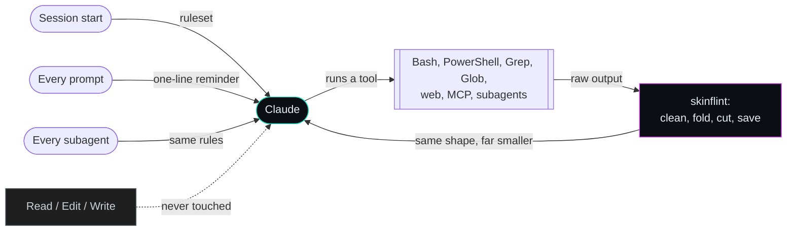

<p align="center">
  
</p>

<h1 align="center">skinflint</h1>

<p align="center">
  <b>Make Claude Code say more with fewer tokens.</b><br>
  Shorter answers, leaner code, trimmed tool output. Zero dependencies.
</p>

<p align="center">
  
  
  
  
</p>

---

Every token Claude writes, and every line of tool output it reads, is paid for
again on each later turn. skinflint cuts the ones that carry nothing and
keeps every one that carries a fact.

<p align="center"><b>51% fewer output tokens than no plugin, the fewest of four plugins tested &middot; 4.2% of tool output trimmed before Claude reads it &middot; about $87 a month saved on one developer's real usage &middot; zero dependencies</b></p>

- **Tighter answers.** The answer first, the likely cause and its fix, no
  filler, no recap, no wall of headings and bullets.
- **Leaner code.** The smallest change that works: reuse, then the standard
  library, then the platform, before any new code or dependency.
- **Trimmed tool output.** Long command output is cleaned and cut before
  Claude reads it. Error lines from the cut part are kept, and the full text
  is saved to a file Claude can search instead of re-running the command.
- **Nothing to install.** Pure POSIX `sh` + `awk` on Linux, macOS and WSL; on
  Windows a small program built on first use with the compiler that ships
  with Windows. No Node, no Python, no package manager.
- **Faster than every other plugin measured.** On every hook, on Linux and on
  Windows from Git Bash, PowerShell 5.1 and PowerShell 7, skinflint's hooks
  finish first (see [Faster hooks](#faster-hooks)).
- **Tested to the byte.** One written [specification](SPEC.md), two
  implementations, 176 test cases that must produce identical bytes on both.

Same model, same question, one difference: skinflint. Both answers are
verbatim from the [benchmark run](https://github.com/SkYn3t-Lab/skinflint-tests/blob/main/benchmarks/results/2026-09-30/cells.jsonl),
except that headings are shown in bold so they do not become sections of this
page:

> What is the difference between git merge and git rebase?

<table>
<tr><th align="left" width="50%">No plugin: 670 output tokens</th>
<th align="left" width="50%">skinflint: 182 output tokens</th></tr>
<tr valign="top"><td>

Both commands integrate changes from one branch into another. They differ in how they record that in history.

**Merge**

`git merge feature`, run from `main`, creates a new **merge commit** with two parents. It joins the two lines of history.

- Existing commits are left unchanged.
- History shows exactly what happened, including when branches diverged and rejoined.
- Repeated merges can make the log branchy and noisy.

```
A---B---C---M   main
     \     /
      D---E     feature
```

**Rebase**

`git rebase main`, run from `feature`, takes your branch's commits and **replays them** on top of the target branch's tip. Each replayed commit is a new commit with a new hash.

- The result is a linear history with no merge commit.
- The log is easier to read and `git bisect` is easier to use.
- Commits are rewritten, so the original timeline is lost.

*... 22 more lines*

</td><td>

`git merge` joins two branches by creating a new merge commit with two parents. History stays exactly as it happened, including the branch point, but it becomes non-linear.

`git rebase` replays your branch's commits one by one on top of another branch's tip, creating new commits with new hashes. History becomes a straight line, but the original commits are rewritten.

Use merge for shared or public branches. Use rebase to tidy up local, unpushed work before merging. Never rebase commits others have already pulled, because rewriting them forces everyone else to reconcile diverged history.

</td></tr>
</table>

## What it trims

| | The waste | What skinflint does |
|---|---|---|
| **Prose** | Preambles, recaps, hedging, headings and bullet walls nobody asked for | A short ruleset at session start, and a one-line reminder with every prompt |
| **Code** | Abstractions with one user, boilerplate "for later", new dependencies for a few lines | A decision ladder: reuse, standard library, platform, installed dependency, then the least new code |
| **Tool output** | Build logs, test runs, stack traces and listings read into context and billed again every turn | Cleaned and cut before Claude reads it; errors kept; the full text saved to a file |



Tool output is the part that compounds: every line read into the
conversation is sent again with each later request, so cutting it once pays
off on every turn after.

---

## Everything it does

### Answers and code

- **Ruleset at session start**, and again after `/clear` or compaction, so the
  rules are never summarised away. A resumed session gets a one-line nudge
  instead of the whole ruleset again.
- **A one-line reminder with every prompt**, so the rules steer every answer,
  not only the first one after the session starts.
- **Code first, three lines after.** Code comes before any words about it,
  followed by at most three short lines on what was left out and when to add
  it. No second version, no usage demo, no test file nobody asked for, and
  code you asked to see arrives in the reply rather than in a new file.
- **No narration between tool calls.** No "now I will..." before each command
  and no summary of a result it is about to act on.
- **Shortcuts you can find again.** A corner deliberately cut in the code gets
  a `skinflint:` comment naming its limit, and `/skinflint-debt` lists
  them all later.
- **Subagents follow the same rules.** Every subagent Claude starts is told to
  report back the same way.
- **On and off per session, or per project.** The mode belongs to the session
  and survives compaction; another session keeps its own. A project can turn
  it off, or drop the prose or code rules, with `.claude/skinflint.json`.
- **Switches that don't misfire.** Only a whole message such as
  `stop skinflint` switches it; "add a normal mode toggle" does not.
- **Plays well with output styles.** If you use a custom output style, the prose
  rules step aside for it. Prose and code rules can each be switched off.

### Tool output

Applied to Bash, PowerShell, Grep, Glob, WebFetch, WebSearch, subagent results
and every MCP tool:

| Noise | Becomes |
|---|---|
| Colour codes, trailing spaces, blank-line runs | removed |
| Progress bars redrawn with `\r` | only the final state |
| The same line repeated | one line + "repeated N more times" |
| Log lines that differ only in their timestamp | first, a count, last |
| 40-frame stack traces (JavaScript, Java, C#, Python, gdb) | first 3 and last 2 frames |
| Hundreds of passing tests (Jest, Go, pytest, TAP, "PASS") | first, a count, last; failures always kept |
| A 500 KB line of minified JSON | its head and tail |
| Windows UTF-16 output (a NUL after every letter) | plain text |
| Still over 8 KB | first 60 and last 40 lines, plus the first 12 error lines from the middle with one line of context each |
| The exact same output as last time | a one-line note and its first lines |

- **Nothing is lost.** Whenever lines are cut, the full text is saved to a file
  and the note tells Claude where, so it searches the file instead of running
  the command again.
- **Knows an error from a success.** "0 errors", "no failures" and
  "errors: 0" are not treated as errors; "terror" and "errorless" are not
  either.
- **Secrets stay off disk.** Output that looks like it holds a private key, an
  API key, a token or a password is never saved to a file.
- **Leaves alone what must stay exact.** Read, Edit and Write are never
  touched. `cat`, `head`, `git diff`, `Get-Content` and similar commands are
  kept whole up to 12 KB, because Claude asked to see that text; beyond that
  only their head and tail are kept, with the full text saved. Claude Code
  edits a file only after reading it with Read, so this never changes what an
  edit is based on. Failed commands and output Claude Code already saved to
  disk pass through unchanged.
- **Keeps the tool's own shape.** Only the text fields change; every other
  field of the result is passed on byte for byte. Cuts never split a UTF-8
  character.
- **Cleans up after itself.** The newest 40 saved outputs are kept, and session
  state older than a week is removed.

### Everywhere, with nothing to install

- **Linux, macOS, WSL:** POSIX `sh` + `awk`. Tested with mawk, gawk, BWK awk
  (macOS) and busybox awk, under dash, bash and busybox `sh`.
- **Windows:** a small program compiled on first use by the C# compiler that
  ships with Windows. Works from Git Bash, Windows PowerShell 5.1 and
  PowerShell 7, and PowerShell's script execution policy does not matter.
- **No network access**, ever. No telemetry, no update check.
- **Private state.** Everything it writes lives in `~/.claude/skinflint/`,
  readable only by you.

### Extras

- `/skinflint-stats` shows how much tool output has been trimmed so far.
- `/skinflint-debt` lists every shortcut marked with a `skinflint:`
  comment, with when it would be worth doing properly.
- `/skinflint-review` reviews your diff for code that can be deleted.
- `/skinflint-audit` ranks everything removable in a file, diff or repo, code
  and prose, biggest first.
- A status line showing the mode and roughly how many tokens have been saved.

## How it compares

Measured in the benchmarks below, or read from each plugin's own code:

| | skinflint | [chisle](https://github.com/JayPokale/Chisle) | [ponytail](https://github.com/dietrichgebert/ponytail) | [caveman](https://github.com/JuliusBrussee/caveman) |
|---|---|---|---|---|
| Output tokens, 20 tasks (% of no plugin) | **49%** | 63% | 67% | 75% |
| Worst task (% of no plugin) | **68%** | 80% | 110% | 105% |
| Correct answers | 54/56 | 54/56 | 55/56 | 55/56 |
| Trims tool output | **yes, 4.2%** | yes, 4.0% | no | no |
| Needs a runtime | **no** | Node.js | Node.js | Node.js |
| Prompt hook, Linux / Windows Git Bash | **7 ms / 95 ms** | 40 ms / 120 ms | 39 ms / 105 ms | 44 ms / 163 ms |
| Works on Windows without Git Bash | **yes** | yes | yes | no, its hooks fail under PowerShell |
| Trims PowerShell tool output (Windows' default shell tool) | **yes** | no | no tool-output trimming | no tool-output trimming |
| Steers subagents | **yes** | no | yes | no |
| Keeps secrets out of saved output | **yes** | no | saves no output | saves no output |
| Network calls | **none** | an update check | none | none |

## Install

You need Claude Code and nothing else. Install once per computer.

**1. Open a terminal** (Terminal on macOS and Linux, PowerShell or Git Bash on
Windows). Run these two commands there, not inside a Claude Code session:

```sh
claude plugin marketplace add SkYn3t-Lab/skinflint
claude plugin install skinflint@skinflint
```

- The first command tells Claude Code where to find the plugin: this GitHub
  repository. Claude Code calls such a source a *marketplace*. It prints
  `Successfully added marketplace: skinflint`.
- The second installs the plugin for your user, in every project. The name
  reads *plugin*@*marketplace*; here both are called `skinflint`.

**2. Start a new Claude Code session.** A session that was already open picks
the plugin up after you type `/reload-plugins` in it.

**3. Check it works.** In the session, type `/skinflint-help`: it lists the
commands below. From a terminal, `claude plugin list` includes
`skinflint@skinflint`. On Windows the very first hook builds a small helper
program, which takes under a second and happens once.

If you use another plugin that does the same job, uninstall it first, or
everything is trimmed twice.

**Prefer to stay inside Claude Code?** Type the same two steps as slash
commands. The second opens a panel: choose *Install for you*.

```text
/plugin marketplace add SkYn3t-Lab/skinflint
/plugin install skinflint@skinflint
```

**If adding the marketplace fails**, git on your computer cannot reach the
repository. Claude Code clones it with your normal git setup, so sign in to
GitHub the way you usually do (for example `gh auth login`) and run the
command again.

### Update

```sh
claude plugin marketplace update skinflint
claude plugin update skinflint@skinflint
```

The first fetches the latest version from GitHub, the second installs it.
Start a new session (or `/reload-plugins`) to use it.

### Remove

```sh
claude plugin uninstall skinflint@skinflint
claude plugin marketplace remove skinflint
```

The first removes the plugin; the second removes the marketplace entry as
well. Either one alone switches skinflint off.

## Use

| Say or type | What happens |
|---|---|
| `/skinflint`, `skinflint on` | Turn it on for this session |
| `stop skinflint`, `normal mode`, `/skinflint off` | Turn it off for this session |
| `/skinflint-stats` | How much tool output has been trimmed so far |
| `/skinflint-debt` | List every shortcut marked with a `skinflint:` comment |
| `/skinflint-review` | Review the current diff for code that can be removed |
| `/skinflint-audit [path]` | Rank everything removable, code and prose, biggest first |
| `/skinflint-help` | Show this list |

A switch works only as the whole message: "add a normal mode toggle" does not
turn anything off. The mode belongs to the session and survives compaction.

## Settings

Environment variables, in `settings.json` under `env` or in your shell:

| Variable | Effect |
|---|---|
| `SKINFLINT_DEFAULT_MODE=off` | Sessions start off; turn it on per session |
| `SKINFLINT_COMPRESS=0` | Leave tool output alone |
| `SKINFLINT_DEDUP=0` | Do not replace repeated output |
| `SKINFLINT_SPILL=0` | Do not save full text to disk |
| `SKINFLINT_TOOLS=Bash,Grep` | Only these tools |
| `SKINFLINT_MAX_BYTES` | Size before lines are cut (default 8000) |
| `SKINFLINT_HEAD_LINES`, `SKINFLINT_TAIL_LINES` | Lines kept at each end (60, 40) |

A config file does the same for the mode and for which parts of the rules load:
`~/.config/skinflint/config.json` (`%APPDATA%\skinflint\config.json` on
Windows):

```json
{ "defaultMode": "on", "sections": { "prose": true, "code": true } }
```

A project can override any of these keys in `.claude/skinflint.json` at its
root, for example `{ "defaultMode": "off" }` to keep skinflint out of one
repository. The environment variable still wins over both files, and a switch
typed in a session wins over everything for that session.

If you use a custom output style, the prose rules step aside for it.

**Status line** (optional): `sh "<plugin>/hooks/statusline.sh"`, or on Windows
`powershell -NoProfile -ExecutionPolicy Bypass -File "<plugin>\hooks\win\statusline.ps1"`.
It shows the mode and roughly how many tokens have been saved.

State lives in `~/.claude/skinflint/`: per-session mode, the last output of
each tool for the duplicate check, saved full texts (the newest 40 are kept)
and a running total.

## Numbers

### Fewer output tokens

Twenty everyday developer requests, five each of short and long coding tasks
and short and long explanations, sent through `claude -p` on Claude Sonnet 5.5.
Each plugin is loaded as a real plugin, in a throwaway configuration that holds
nothing but the login, so the plugin is the only difference. Every request ran
twice per arm (`cache`, `envvar`, `ratelimit`, `restgraphql` ran 6 times, to
settle close results), and a separate blind judge graded every answer for
correctness without knowing which plugin wrote it. Plugins:
[chisle](https://github.com/JayPokale/Chisle) 3.5.0,
[ponytail](https://github.com/dietrichgebert/ponytail) 4.10.0,
[caveman](https://github.com/JuliusBrussee/caveman) 2.7.0.

<p align="center"><picture>
  <source media="(prefers-color-scheme: dark)" srcset="https://raw.githubusercontent.com/SkYn3t-Lab/skinflint-tests/main/assets/charts/output-overall-dark.png">
  
</picture></p>

| Plugin | Output tokens, all tasks | Average task | Worst task | Tasks longer than no plugin | Correct answers |
|---|--:|--:|--:|--:|--:|
| **skinflint** | **49%** | **46%** | **68%** (ratelimit) | **0** | 54/56 |
| [chisle](https://github.com/JayPokale/Chisle) | 63% | 62% | 80% (unrelated) | 0 | 54/56 |
| [ponytail](https://github.com/dietrichgebert/ponytail) | 67% | 67% | 110% (retry) | 1 | **55/56** |
| [caveman](https://github.com/JuliusBrussee/caveman) | 75% | 73% | 105% (cache) | 2 | **55/56** |
| no plugin | 100% | 100% | 100% | 0 | 54/56 |

Output tokens are a share of what the same model wrote with no plugin, so lower
is better. skinflint is shortest overall, in every kind of task, and has the
best worst case; no task came out longer than without it.

Correctness is a tie: the plugins are one answer apart out of 56, and the
answers they missed were spread across plugins rather than piling up in one.
The extra runs on four tasks exist to check exactly that.

<p align="center"><picture>
  <source media="(prefers-color-scheme: dark)" srcset="https://raw.githubusercontent.com/SkYn3t-Lab/skinflint-tests/main/assets/charts/output-by-kind-dark.png">
  
</picture></p>

| Kind of task | skinflint | [chisle](https://github.com/JayPokale/Chisle) | [ponytail](https://github.com/dietrichgebert/ponytail) | [caveman](https://github.com/JuliusBrussee/caveman) |
|---|--:|--:|--:|--:|
| Coding, short | **42%** | 58% | 70% | 87% |
| Coding, long | **56%** | 64% | 63% | 84% |
| Explaining, short | **38%** | 62% | 66% | 57% |
| Explaining, long | **49%** | 63% | 69% | 71% |

<details>
<summary>Every task (skinflint shortest on 20 of 20)</summary>

| Task | Kind | No plugin, tokens | skinflint | chisle | ponytail | caveman |
|---|---|--:|--:|--:|--:|--:|
| `debounce` | coding, short | 1018 | **43** | 65 | 62 | 94 |
| `dedupe` | coding, short | 334 | **26** | 36 | 33 | 49 |
| `envvar` | coding, short | 267 | **46** | 67 | 56 | 88 |
| `offbyone` | coding, short | 158 | **50** | 71 | 59 | 61 |
| `retry` | coding, short | 617 | **45** | 52 | 110 | 102 |
| `cache` | coding, long | 1502 | **56** | 64 | 57 | 105 |
| `migration` | coding, long | 1178 | **64** | 76 | 71 | 87 |
| `statemachine` | coding, long | 2122 | **28** | 43 | 48 | 78 |
| `csvreport` | coding, long | 2018 | **62** | 69 | 63 | 78 |
| `ratelimit` | coding, long | 3209 | **68** | 69 | 73 | 82 |
| `backref` | explain, short | 198 | **49** | 74 | 89 | 55 |
| `pooling` | explain, short | 1243 | **32** | 51 | 60 | 53 |
| `gitrebase` | explain, short | 614 | **27** | 68 | 65 | 46 |
| `unrelated` | explain, short | 623 | **52** | 80 | 72 | 79 |
| `deadlock` | explain, short | 962 | **41** | 55 | 66 | 57 |
| `restgraphql` | explain, long | 1238 | **30** | 31 | 62 | 55 |
| `postmortem` | explain, long | 3036 | **64** | 65 | 86 | 80 |
| `monolith` | explain, long | 2568 | **50** | 61 | 84 | 78 |
| `apidesign` | explain, long | 4382 | **45** | 69 | 53 | 69 |
| `rerender` | explain, long | 1436 | **47** | 70 | 63 | 57 |

Figures are % of no plugin, the lowest in bold. Every prompt is in
[`benchmarks/tasks.tsv`](https://github.com/SkYn3t-Lab/skinflint-tests/blob/main/benchmarks/tasks.tsv) and every answer with its grade
in [`benchmarks/results/2026-09-30/cells.jsonl`](https://github.com/SkYn3t-Lab/skinflint-tests/blob/main/benchmarks/results/2026-09-30/cells.jsonl).

</details>

### Less tool output

Output-token rules only shape what Claude writes; tool output is what it reads,
and every line of it is sent again with each later request. To measure that
part, 7,677 real tool results from 627 of the author's own Claude Code sessions
were replayed through each plugin's PostToolUse hook, in session order, exactly
as Claude Code would have sent them:

| Plugin | Tool output removed | Results shortened |
|---|--:|--:|
| **skinflint** | **4.2%** | **97** |
| [chisle](https://github.com/JayPokale/Chisle) | 4.0% | 84 |
| [ponytail](https://github.com/dietrichgebert/ponytail) | 0% (no tool-output hook) | 0 |
| [caveman](https://github.com/JuliusBrussee/caveman) | 0% (no tool-output hook) | 0 |

Most tool results are short and pass through untouched; the saving comes from
the 97 long ones skinflint shortened. Results Claude Code had already saved
to a file (21 of them) are left out for both, since Claude only ever saw a
short preview of those.

### What it saves in dollars

**About $87 a month, or roughly $1,040 a year, for one developer.** That is
what skinflint would have saved on a month of the author's real Claude Code
use: 7.0 million output tokens on Opus models, $160 of output at list price.

| Plugin | Saved on what Claude writes | Saved on tool output it reads | Saved per month |
|---|--:|--:|--:|
| **skinflint** | **$81.74** | **$5.14** | **$86.88** |
| [chisle](https://github.com/JayPokale/Chisle) | $59.30 | $4.89 | $64.20 |
| [ponytail](https://github.com/dietrichgebert/ponytail) | $52.89 | no tool-output trimming | $52.89 |
| [caveman](https://github.com/JuliusBrussee/caveman) | $40.07 | no tool-output trimming | $40.07 |

In plain terms: Claude writes about half as many output tokens with
skinflint, so roughly $51 of every $100 you spend on Claude's output stays in
your pocket, and trimmed tool output saves a little more on top.

**Your own number.** Run this from a clone of [skinflint-tests](https://github.com/SkYn3t-Lab/skinflint-tests)
against your own Claude Code history; it reads
token counts and sizes only, never the text of your sessions:

```sh
python3 benchmarks/usage.py ~/.claude/projects
```

<details>
<summary>How the estimate is made</summary>

For each model in the transcripts, the output tokens it produced are priced at
Anthropic's list price and multiplied by the share each plugin removes in the
head-to-head benchmark above. For tool output, the tokens read from the tools
the replay covers are multiplied by the share each plugin removed in the
replay; each removed token is paid once when first read (a prompt-cache write,
1.25 times the input price) and again on every later request that re-reads it
from the cache, which in these sessions was a median of 80 requests before the
session ended or was compacted. Months are 30 days. It is an estimate: your
bill also depends on how much of it is output, on caching, and on how long
your sessions run.

</details>

The benchmark scripts and their results live in their own repository,
[skinflint-tests](https://github.com/SkYn3t-Lab/skinflint-tests), so that installing the plugin does not download them.
Reproduce everything from a clone of it with
`ARMS="none:- skinflint:<dir> ..." bash benchmarks/run-arms.sh OUTDIR`,
`bash benchmarks/grade.sh OUTDIR GRADES.json`,
`python3 benchmarks/analyze-arms.py OUTDIR GRADES.json`,
`python3 benchmarks/replay.py --arm skinflint='sh <dir>/hooks/run.sh compress' ~/.claude/projects --out R.json`
and `python3 benchmarks/usage.py`. The data behind every number here is in
[`benchmarks/results/2026-09-30/`](https://github.com/SkYn3t-Lab/skinflint-tests/tree/main/benchmarks/results/2026-09-30).

### Faster hooks

Every hook Claude Code runs costs time on every prompt, tool call and session
start. Each plugin's own hook commands were timed the way Claude Code runs
them, as medians of 41 interleaved rounds so that load on the machine falls on
every plugin alike, with [`benchmarks/speed.py`](https://github.com/SkYn3t-Lab/skinflint-tests/blob/main/benchmarks/speed.py) on Linux
and [`benchmarks/speed.ps1`](https://github.com/SkYn3t-Lab/skinflint-tests/blob/main/benchmarks/speed.ps1) on Windows 11.

<p align="center"><picture>
  <source media="(prefers-color-scheme: dark)" srcset="https://raw.githubusercontent.com/SkYn3t-Lab/skinflint-tests/main/assets/charts/speed-dark.png">
  
</picture></p>

| Linux, ms | startup | prompt | subagent | 30 KB log | 150 KB log | 150 KB JSON |
|---|--:|--:|--:|--:|--:|--:|
| **skinflint** | **10** | **7** | **7** | **12** | **16** | **15** |
| [chisle](https://github.com/JayPokale/Chisle) | 136 | 40 | no hook | 69 | 75 | 66 |
| [ponytail](https://github.com/dietrichgebert/ponytail) | 36 | 39 | 42 | no hook | no hook | no hook |
| [caveman](https://github.com/JuliusBrussee/caveman) | 43 | 44 | no hook | no hook | no hook | no hook |

| Windows 11, ms | startup | prompt | subagent | small output | 3000 lines | 30 KB log |
|---|--:|--:|--:|--:|--:|--:|
| **skinflint**, Git Bash | **100** | **95** | **95** | **98** | **120** | **125** |
| [chisle](https://github.com/JayPokale/Chisle), Git Bash | 260 | 120 | no hook | 122 | 153 | 150 |
| [ponytail](https://github.com/dietrichgebert/ponytail), Git Bash | 109 | 105 | 104 | no hook | no hook | no hook |
| [caveman](https://github.com/JuliusBrussee/caveman), Git Bash | 167 | 163 | no hook | no hook | no hook | no hook |
| **skinflint**, PowerShell 5.1 | **166** | **164** | **162** | **167** | **194** | **194** |
| [chisle](https://github.com/JayPokale/Chisle), PowerShell 5.1 | 331 | 188 | no hook | 188 | 220 | 224 |
| [ponytail](https://github.com/dietrichgebert/ponytail), PowerShell 5.1 | 193 | 186 | 182 | no hook | no hook | no hook |
| [caveman](https://github.com/JuliusBrussee/caveman), PowerShell 5.1 | fails | fails | no hook | no hook | no hook | no hook |
| **skinflint**, PowerShell 7 | **317** | **301** | **316** | **322** | **363** | **366** |
| [chisle](https://github.com/JayPokale/Chisle), PowerShell 7 | 494 | 343 | no hook | 346 | 383 | 371 |
| [ponytail](https://github.com/dietrichgebert/ponytail), PowerShell 7 | 344 | 336 | 347 | no hook | no hook | no hook |
| [caveman](https://github.com/JuliusBrussee/caveman), PowerShell 7 | fails | fails | no hook | no hook | no hook | no hook |

The fastest time in each column and shell is in bold. "no hook" means the
plugin does not run anything at that point (ponytail and caveman do not trim
tool output at all). caveman's hook commands are written in shell syntax, so
they fail under PowerShell, which Claude Code uses on Windows when Git Bash is
not installed. ponytail's prompt hook prints nothing on an ordinary prompt: it
only reports mode changes. skinflint needs no runtime: on Linux a hook is one
`sh` and one `awk`; on Windows, Git Bash runs the compiled program directly,
and PowerShell loads it into the PowerShell that is already running, so no
second process starts.

## How one hook line runs everywhere

Claude Code runs a plugin's hook command with `sh` on Linux and macOS, with Git
Bash on Windows, and with PowerShell on Windows without Git Bash. Each hook is
one command that reads correctly in both languages: `sh` sees a no-op group
and then `exec`s the right program, so it never reads further; PowerShell
sees the `sh` lines inside a block comment and runs the lines after it.
`tools/stamp.sh` writes these lines into `.claude-plugin/plugin.json`, and embeds
the awk program (`hooks/lib/skinflint.awk`) in `hooks/run.sh`, so that the POSIX
hook is one file that runs no other.

## Tests

The tests live in [skinflint-tests](https://github.com/SkYn3t-Lab/skinflint-tests). Clone it beside this repository and
run:

```sh
sh skinflint-tests/tests/golden.sh                                            # POSIX
powershell -ExecutionPolicy Bypass -File skinflint-tests\tests\golden.ps1     # Windows
```

Both test the plugin in `../skinflint`; set `PLUGIN_ROOT` to test another copy.
`tests/cases/` holds one case per behaviour in SPEC.md, each with its input,
expected output and expected files on disk. `golden.sh` runs every case through
the real hook line; `golden.ps1` runs it through the Windows program. Both pass
on dash, bash and busybox `sh`, with mawk, gawk, BWK awk and busybox awk, and on
Windows PowerShell 5.1 and PowerShell 7. `tests/make_cases.py` regenerates the
cases (the only part that needs Python).

## License

MIT. See [LICENSE](LICENSE).
